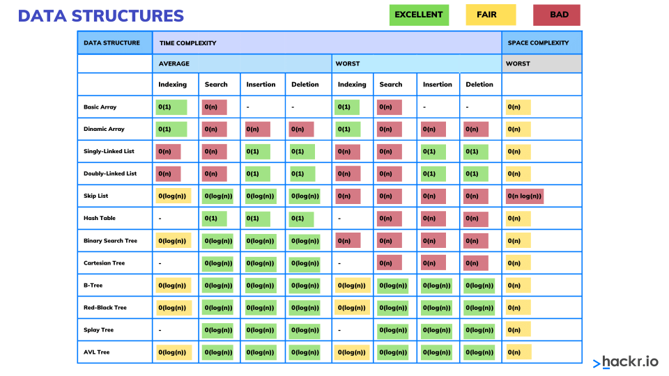
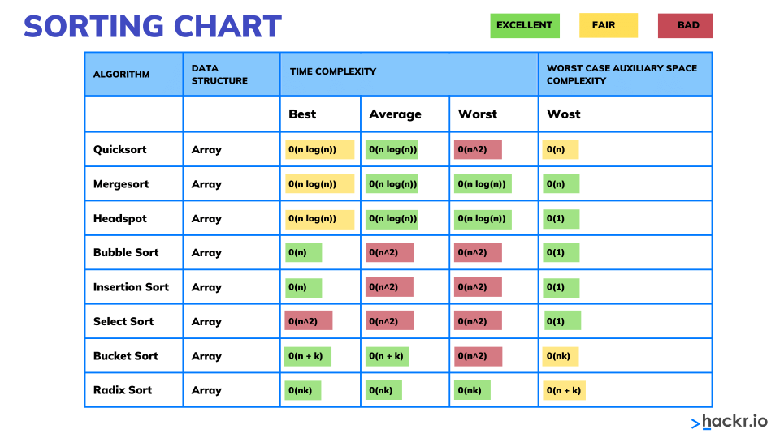

# Big O notation - Summary and key concepts

**_Big O notation_ is a space/time complexity measure for algorithms.**

Algorithms are a set of well-defined instructions for solving a specific problem.

In a way, Big O notation can be thought as the number of operations that a computer program needs to do in order to complete certain task. 

Big O notation represents the worst-case scenario in terms of complexity of an algorithm to achieve certain task. And allows to estimate how long the code will run on different sets of inputs and measure how effectively the code scales as the size of your input increases.

Even though differents situations could lead an algorithm to take more or less complexity to perform certain given operation, the algorithm calification in this terms it is always asummed the worst case.

#### Big O classifications
- **O($1$):** Is the best space/time complexity scenario, in which the algorithm will take 1 step to complete the operation regardless any input. Also known as *constant time complexity*.
- **O($log \text{ } n$):** An algorithm whose performance improves in proportion to the logarithm of the input size. (2nd most efficient classification).
- **O($n$):** An algorithm whose performance will grow linearly and in direct proportion to the size of the input data. A common example of this complexity are classical for loops that traverses a sequence of data. 
- **O($n\text{ } log \text{ } n$):** An algorithm whose performance is directly proportional to the input size but also includes a growth factor of the logarithm of that input size. Common examples are quicksort, mergesort and heapsort.
- **O($n^2$):** An algorithm whose performance is driectly proportional to the square of the size of the input data. This is common through algorithms that involve nested for loops (loops inside another loop). Examples of this space/time complexity classification are bubble sort, selection sort and insertion sort. 
- **O($2^n$):** This represents an algorithm whose growth double with each addtion to the input data. The growth curve of an $O(2^n)$ function is exponential, starting off very shallow, then rising meteorically. An example of an algorithm of this classification is the recursive calculation of Fibonacci numbers. 


---
<p>Tip: There are three greek letters that are related to Big O notation, those are:

- Omega $ \Omega $: Best case scenario for the algorithm.
- Theta  $ \Theta $: Average case scenario for the algorithm.
- Omicron $ \Omicron $: Worst case scenario for the algorithm.
    
</p>

---

## Code examples for complexity


### $O(1)$
```
def print_items(n):
    return print(n+n+n)

print_items(2)

>> 6
```
The previous code shows how, independently the math operation perform in the code, meanwhile the operation could be perform at one-shot, the complexity will be $O(1)$.


### $O(log \text{ } n)$
This is a common complexity to describe how operations are perform over binary trees (which are balanced, such as AVL, red-black, etc). In this cases, the required operations to transverse a 8 node tree is just 3 operations, and indeed 3 = $log_2 \text{ } 8$.

p.s: In trees that are not balanced, the complexity is $O(n)$, the above examples only applies if the tree is indeed balanced.

### $O(n)$
```
def print_items(n):
    for i in range(n):
        print(i)

print_items(10)

>> 0, 1, 2, 3, 4, 5, 6, 7, 8, 9
```
This code shows a simplier $O(n)$ complexity. Transverse each element and perform certain task (in this case, print the element).

```
def print_items_2(n, m):
    for i in range(n):
        print(i)
    
    for j in range(m):
        print(j)


print_items_2(5,10)

>> 0, 1, 2, 3, 4
>> 0, 1, 2, 3, 4, 5, 6, 7, 8, 9
```

In the previous case is also a complexity of $O(n)$ because, regardless of looping two set of data, it is perform one set of data at a time, so it is $O(n+n) \rightarrow O(2n)$ but given that the complexity has a property called **'drop the constant'**, we delete the constant of the complexity notation and left just as $O(n)$.

Other situation would be if, per each element of the first set of data we iterate over all elements of the second set of data and so on, in that case the complexity will scale to $O(n^2)$

### $O(n\text{ }log\text{ }n)$
This time complexity often appears in algorithms that use a divide-and-conquer strategy. The algorithm divides the problem into several smaller subproblems of equal size, solves each subproblem recursively, and then combines the results. The most common examples of such algorithms are sorting algorithms like merge sort and heap sort. The “n” in “n log n” represents the size of the input, and “log n” represents the depth of the recursion tree (i.e., the number of divisions needed to reduce the problem to a trivial size). As the input size “n” grows, the time complexity grows at a rate of “n” times the logarithm of “n”, hence the notation $O(n\text{ }log \text{ }n)$.

### $O(n^2)$
This complexity refers for operations that involves traverse set of data over another set of data:
```
def print_items(n):
    for i in range(n):
        for j in range(n):
            print(i, j)

print_items(3)

>> 0 0, 0 1, 0 2, 1 0, 1 1, 1 2, 2 0, 2 1, 2 2.
```
When the algorithm reach this zone it is recommended to look for less complex impletations. 

Another thing to keep in mind is, if in a given program, I have an algorithm that performs operations in $O(n^2)$ and also $O(n)$, then it is applied the concept of **drop the non-dominants**, which refers to keep the highest complexity performed by the algorithm to describe the implementation, so in the following case, it is still $O(n^2)$.

```
def print_items(n):
    for i in range(n):
        for j in range(n):
            print(i, j)

    for i in range(n):
        print(i)


print_items(3)

>> 0 0, 0 1, 0 2, 1 0, 1 1, 1 2, 2 0, 2 1, 2 2.
>> 0, 1, 2
```


### $O(2^n)$
This time complexity is often associated with algorithms that solve a problem of size “n” by recursively solving two smaller problems of size "n-1". The growth rate doubles with each addition to the input data set. The classic example of an algorithm with this time complexity is the recursive calculation of Fibonacci numbers5. 

---

### Big O: Cheat sheet



</br>

