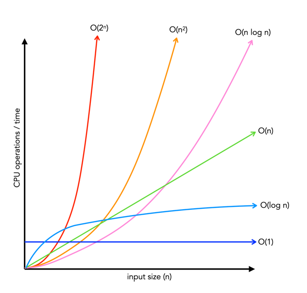
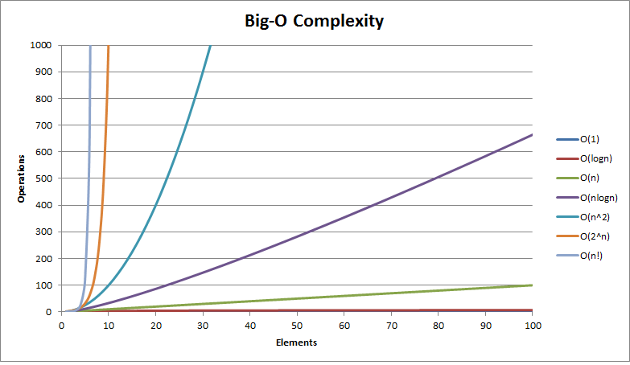

# Big O

This is a huge and important concept, therefore, the book dedicates an entire chapter to it.

Big O time is the language and metric we use to describe the efficiency of algorithms. Not understanding it thoroughly can really hurt in developing an algorithm.

**I should master this concept.**

---

## Time complexity 
In computer science, time complexity refers to the amount of time it takes for an algorithm to execute as a function of the input size. It is a measure of the algorithm's efficiency and its ability to handle large datasets. Time complexity is typically expressed using Big O notation, which represents the upper bound of an algorithm's growth rate.

- **$O(1)$ (Constant time)**: The algorithm takes a constant amount of time regardless of the input size. This means that the execution time remains the same no matter how large the input is. Examples of algorithms with constant time complexity include accessing an element in an array by index or performing a simple arithmetic operation.

- **$O(log n)$ (Logarithmic time)**: The algorithm's execution time grows logarithmically with the input size. This means that the time it takes to execute the algorithm increases very slowly as the input size increases. An example of an algorithm with logarithmic time complexity is binary search, which can find an element in a sorted array in a time proportional to the logarithm of the array's length.

- **$O(n)$ (Linear time)**: The algorithm's execution time grows linearly with the input size. This means that the time it takes to execute the algorithm increases directly proportional to the input size. An example of an algorithm with linear time complexity is linear search, which searches for an element in an unsorted array by comparing it to each element in the array until it is found.

- **$O(n log n)$ (Logarithmic-linear time)**: The algorithm's execution time grows at a rate between logarithmic and linear. This means that the execution time increases more slowly than linearly but faster than logarithmically. An example of an algorithm with logarithmic-linear time complexity is the merge sort algorithm, which is a sorting algorithm that combines the efficiency of merging sorted subarrays with the logarithmic efficiency of binary search.

- **$O(n^2)$ (Quadratic time)**: The algorithm's execution time grows quadratically with the input size. This means that the time it takes to execute the algorithm increases very rapidly as the input size increases. An example of an algorithm with quadratic time complexity is bubble sort, which is a sorting algorithm that repeatedly compares and swaps adjacent elements in the list until it is sorted.

- **$O(2^n)$ (Exponential time)**: The algorithm's execution time grows exponentially with the input size. This means that the time it takes to execute the algorithm increases very rapidly and quickly becomes impractical for large input sizes. An example of an algorithm with exponential time complexity is the brute-force algorithm for solving the knapsack problem, which tries all possible combinations of items to find the optimal solution.

- **$O(n!)$ (Factorial  time)**: This complexity occurs when the algorithm involves generating and evaluating all possible permutations of the input data. For example, the brute-force algorithm for finding the shortest Hamiltonian path in a graph has a factorial time complexity, making it impractical for large graphs.

### Best case, worst case and expected case
We can describe the algorithm runtime in three different ways.

A concrete example of describe this is through the Quick Sort algorithm. It picks a random element as a pivot and then swaps values in the array such that the elements less than pivot appear before elements greater than pivot.
- **Best case:** If all elements are equal, then quick sort will on average just traverse through the array once. This is $O(n)$.

- **Worst case:** If we get unlucky and the pivot is repeatdly the biggest element in the array? (this can happen if the array is sorted in reverse order). In this case, the recursion doesn't divide the array in half and recurse on each half. This degenerate to a $O(n^2)$

- **Expected case:** Usually, these wonderful or terrible situations won't happen. Could be, but it most certainly not be over and over again. We can expect a runtime of $O(n\text{ }log\text{ }n)$.

Commonly, it is not discussed the best case time complexity, because it doesn't represent the majority of the cases. After all, we could take essentially any algorithm, brute force certain input, and then get an $O(1)$ time in the best case.

Also, for many algorithms, the worst case and the expected case are the same. Sometimes they're different, though, and we need to describe both runtimes.

---

## Space Complexity

Time is not the only thing that matters in an algorithm. I need to take care of also about the amount of memory (or space) required by an algorithm.

Space complexity is a parallel concept to time complexity. If we need to create an array of size n, this qill require $O(n)$ space.