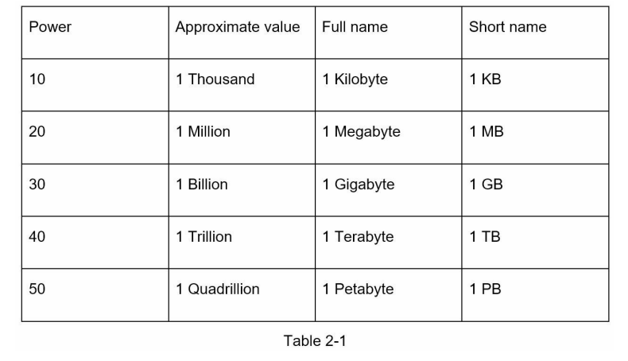
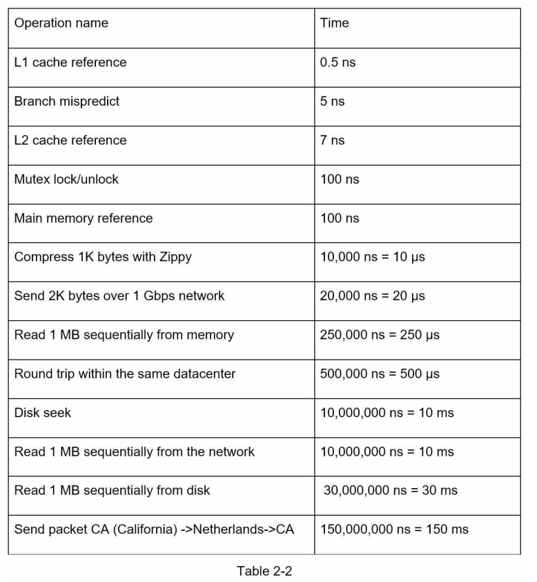
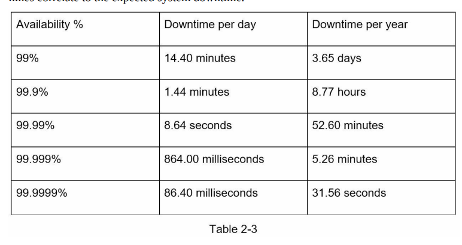

# Back-of-the-envelope estimation

It is usual in system design, there are times when the interviewer ask to estimate the system capacity or performance requirements using a back-of-the-envelope estimation.

According to Jeff Dean (Google senior fellow), "back-of-the-envelope calculation are estimates you create using a combination of thought experiments and common performance numbers to get a good feel for which designs will meet the requirements".

I need to have a good sense of scalability basics to effectively carry out back-of-the-envelope estimation. The following concepts should be well understood: 
- power of two, 
- latency numbers every programmer should know,
- availability numbers.

---

## Power of two
Altough data volume can become enourmes when dealing with distributed systems. Calculation all boils down to the basics.

To obtain correct calculation it is critical to known the data volumen unit using the power of 2. A byte is a sequence of 8 bits. An ASCII characters uses one byte of memory (8 bits). Below is a table exaplining the data volume.

## Latency numbers every programmer should know
Dr.Dean from Google revealts the length of typical computer operations in 2010. Some numbers are outdated as computers become faster and more powerful. However, those numbers should still be able to give us an idea of the fastness and slowness of different computer operations.

A more depth understanding of the numbers gave us the following conclusions:
- Memory is fast but the dist is slow,
- Acoid disk seeks if possible,
- Simple compression algorithms are fast,
- Compress data before sending it over the internet if possible,
- Data centers are usually in different regions and it takes time to send data between them.

## Availability numbers
High availability is the ability of a system to be continousl yoperatuonal for a desirable long period of time. High availability is measured as a percentage, with 100% means a service that has 0 downtime. Most services fall between 99% and 100%.

A **serivce legal agreement (SLA)** is a commonly used term for service providers. This is an agreement between you (the service provider) and the customer, this agreement formally defines the level of uptime the service will deliver. Cloud providers as Amazon, Google and Microsoft set their SLAs at 99.9% or above. Uptime is traditionally measured in nines. The more nines, the better. 

As the following table shows, the numbers of nines correlate to the expected system downtime.

## Example: Estimates Twitter QPS and storage requirements
*Please note that the numbers of this exercise are not real numbers from twitter*.

Assumptions:
- 300 million monthly active users,
- 50% of users use Twitter daily,
- Users post 2 tweets per day on average,
- 10% of tweeets contain media,
- Data is stored for 5 years.

Estimations:

Query per second (QPS) estimate::
- Daily active users (DAU) = 300 million * 50% = 150million
- Tweets QPS = 150 million * 2 tweets / 24hours/ 3600seconds = ~3500
- Peek QPS = 2 * QPS = ~7000

We will only estimate media storage here

Average tweet size:
- tweet_id: 64 bytes
- text: 140 bytes
- media: 1 MB

Media storage: 150 millon * 2*

 